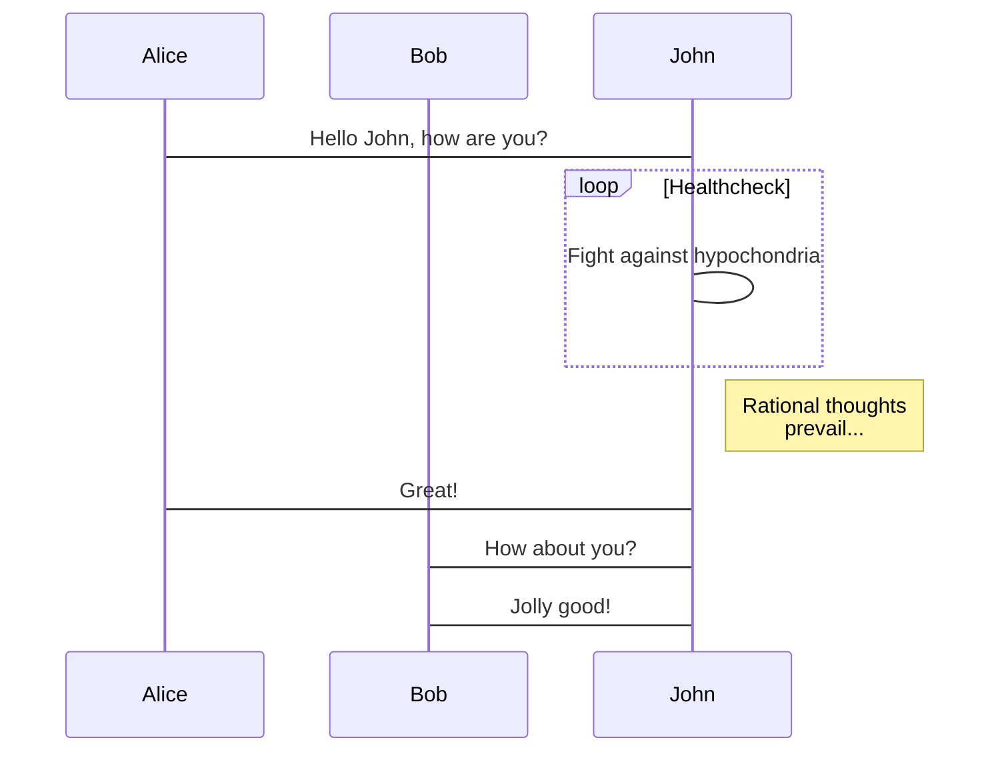
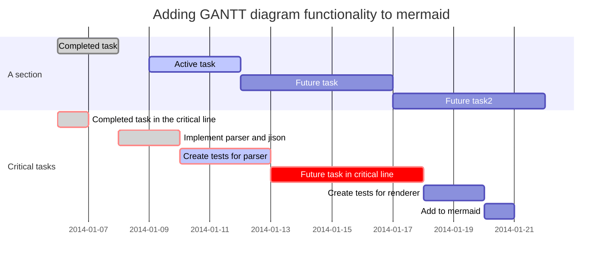

### 标题
```markdown
Markdown语法：

# 一级标题
## 二级标题
### 三级标题
#### 四级标题
##### 五级标题
###### 六级标题
大标题
=
小标题
-
```

预览效果：

### 粗体、斜体
```markdown
Markdown语法：

**粗体**
__粗体__
*斜体*
_斜体_
```
预览效果：

**粗体**
__粗体__
*斜体*
_斜体_

----

### 分割线
```markdown
Markdown语法：
---
***
~~文字删除线~~
```
预览效果：

---
***
~~文字删除线~~

----

### 列表
```markdown
Markdown语法：

- 无序列表项目
- 无序列表项目
- 无序列表项目

* 无序列表项目
* 无序列表项目
* 无序列表项目

1. 有序列表项目
2. 有序列表项目
3. 有序列表项目

- 外层列表项目
 + 内层列表项目
 + 内层列表项目
 + 内层列表项目
- 外层列表项目
```

预览效果：

- 无序列表项目
- 无序列表项目
- 无序列表项目

* 无序列表项目
* 无序列表项目
* 无序列表项目

1. 有序列表项目
2. 有序列表项目
3. 有序列表项目

- 外层列表项目
 + 内层列表项目
 + 内层列表项目
 + 内层列表项目
- 外层列表项目

----

### 添加超链接、图片
```markdown
Markdown语法：

[简书](链接地址 "描述")


[简书][1]
![简书slogan][2]

[1]:链接地址 "描述"
[2]:链接地址 "描述"

[无链接的链接][null-link]
[null-link]: chrome://not-a-link

```
效果预览：

[简书](链接地址 "描述")


[简书][1]

![简书slogan][2]

[1]:链接地址 "描述"
[2]:http://www.onethink.cn/Uploads/Editor/2013-12-13/52aaabb4e7486.png "描述"
[无链接的链接][null-link]
[null-link]: chrome://not-a-link

----

### 添加表格
```markdown
Markdown语法：

| ABCD | EFGH | IJKL |
| -----|:----:| ----:|
| a    | b    | c    |
| d    | e    |  f   |
| g    | h    |   i  |

ABCD | EFGH | IGKL
-----|------|----
a    | b    | c
d    | e    | f
g    | h    | i
```
预览效果：

| ABCD | EFGH | IJKL |
| -----|:----:| ----:|
| a    | b    | c    |
| d    | e    |  f   |
| g    | h    |   i  |

ABCD | EFGH | IGKL
-----|------|----
a    | b    | c
d    | e    | f
g    | h    | i

----

### 添加代码
```markdown
Markdown语法：

`字符`（简短文字添加代码框）

`Tab`或
    四个空格（大段文字添加代码框，每行前添加）
```
预览效果：

`字符`（简短文字添加代码框）

`Tab`或
    四个空格（大段文字添加代码框，每行前添加）

----

### 引用
```markdown
Markdown语法：

> 引用的文字
> 引用的文字
> 引用的文字

---
> 引用的文字引用的文字引用的文字引用的文字引用的文字引用的文字引
用的文字引用的文字引用的文字引用的文字引用的文字引用的文字引用
的文字引用的文字引用的文字

---
> 引用的文字引用的文字引用的文字引用的文字引用的文字

---
 >> 引言内的引言引言内的引言引言内的引言

---
> 引用的文字引用的文字引用的文字引用的文字引用的文字
```
预览效果：

> 引用的文字
> 引用的文字
> 引用的文字

---
> 引用的文字引用的文字引用的文字引用的文字引用的文字引用的文字引
用的文字引用的文字引用的文字引用的文字引用的文字引用的文字引用
的文字引用的文字引用的文字

---
> 引用的文字引用的文字引用的文字引用的文字引用的文字

---
 >> 引言内的引言引言内的引言引言内的引言

---
> 引用的文字引用的文字引用的文字引用的文字引用的文字

----

### 单行长文字
```markdown
Markdown语法：

在需要以单行长文字显示的文字两段各加三个`~`,即`~~~`

在需要以单行长文字显示的文字段落前加四个空格
```
预览显示：
```markdown
单行长文字单行长文字单行长文字单行长文字单行长文字单行长文字单行长文字单行长文字单行长文字单行长文字单行长文字单行长文字单行长文字单行长文字

----
```
### 首行缩进
```markdown
Markdown语法：

 缩进一个字符缩进一个字符缩进一个字符缩进一个字符缩进一个字符缩进一个字符

 缩进两个字符缩进两个字符缩进两个字符缩进两个字符缩进两个字符缩进两个字符

  缩进四个字符缩进四个字符缩进四个字符缩进四个字符缩进四个字符缩进四个字符

预览效果：

 缩进一个字符缩进一个字符缩进一个字符缩进一个字符缩进一个字符缩进一个字符

 缩进两个字符缩进两个字符缩进两个字符缩进两个字符缩进两个字符缩进两个字符

  缩进四个字符缩进四个字符缩进四个字符缩进四个字符缩进四个字符缩进四个字符

----
```
### 添加脚注
```markdown
Markdown语法：

添加脚注
```
预览效果：

A [[1]](http://www.jianshu.com/p/21d355525bdf#fn_lemma_a "描述")

----

### 创建链接
```markdown
为输入的URL或邮箱自动创建链接，如test@domain.com。
Markdown语法：

<test@domain.com>
```
预览效果：

<test@domain.com>

----

### 转义字符
```markdown
在特殊字符，如*、[、>等前面加\可使特殊格式字符转换为正常字符打出（有序列表符号如1.，须在. 前加\）。

Markdown语法：

\\
\`
\*
\_
\{\}
\[\]
\(\)
\#
\+
\-
\.
\!
```
预览效果：

\\
\`
\*
\_
\{\}
\[\]
\(\)
\#
\+
\-
\.

----
\!
### 小型文本
```markdown
Markdown语法：

<small>文本内容</small>
```
预览效果：

<small>文本内容</small>

----

### markdown代码语言
```
Apache
Bash
CoffeeScript
C++
C#
CSS
Diff
HTTP
Ini
Java
JavaScript
JSON
Makefile
Markdown
Nginx
Objective-C
Perl
PHP
Python
Ruby
SQL
HTML, XML
```


----

### 特殊符号 HTML Entities Codes

`&copy;` &copy;
`&` &
`&uml;` &uml;
`&trade;` &trade;
`&iexcl;` &iexcl;
`&pound;` &pound;
`&amp;` &amp;
`&lt;` &lt;
`&gt;` &gt;
`&yen;` &yen;
`&euro;` &euro;
`&reg;` &reg;
`&plusmn;` &plusmn;
`&para;` &para;
`&sect;` &sect;
`&brvbar;` &brvbar;
`&macr;` &macr;
`&laquo;` &laquo;
`&middot;` &middot;
`X&sup2;` X&sup2;
`Y&sup3;` Y&sup3;
`&frac34;` &frac34;
`&frac14;` &frac14;
`&times;` &times;
`&divide;` &divide;
`&raquo;` &raquo;
`18&ordm;C` 18&ordm;C
`&quot;` &quot;
`&apos;` &apos;

### 流程图Mermaid
[](https://mermaid-js.github.io/mermaid/#/)

```
gantt
  title 项目开发流程
  section 项目确定
    需求分析       :a1, 2016-06-22, 3d
    可行性报告     :after a1, 5d
    概念验证       : 5d
  section 项目实施
    概要设计      :2016-07-05  , 5d
    详细设计      :2016-07-08, 10d
    编码          :2016-07-15, 10d
    测试          :2016-07-22, 5d
  section 发布验收
    发布: 2d
    验收: 3d
```

```
graph TD;
    A-->B;
    A-->C;
    B-->D;
    C-->D;
```

# mermaid

## Flowchart


## Sequence diagram



## Gantt diagram




## 特殊

----

### Emoji表情

[GitHub Markdown Emoji 表情](https://www.jianshu.com/p/0520359a18d5)

`:bowtie:`
:bowtie:
`:smile:`
:smile:
`:laughing:`
:laughing:
`:blush:`
:blush:
`:smiley:`
:smiley:
`:relaxed:`
:relaxed:
`:smirk:`
:smirk:
`:heart_eyes:`
:heart_eyes:
`:kissing_heart:`
:kissing_heart:
`:kissing_closed_eyes:`
:kissing_closed_eyes:
`:flushed:`
:flushed:
`:relieved:`
:relieved:
`:satisfied:`
:satisfied:
`:grin:`
:grin:
`:wink:`
:wink:
`:stuck_out_tongue_winking_eye:`
:stuck_out_tongue_winking_eye:
`:stuck_out_tongue_closed_eyes:`
:stuck_out_tongue_closed_eyes:
`:grinning:`
:grinning:
`:kissing:`
:kissing:
`:kissing_smiling_eyes:`
:kissing_smiling_eyes:
`:stuck_out_tongue:`
:stuck_out_tongue:
`:sleeping:`
:sleeping:
`:worried:`
:worried:
`:frowning:`
:frowning:
`:anguished:`
:anguished:
`:open_mouth:`
:open_mouth:
`:grimacing:`
:grimacing:
`:confused:`
:confused:
`:hushed:`
:hushed:
`:expressionless:`
:expressionless:
`:unamused:`
:unamused:
`:sweat_smile:`
:sweat_smile:
`:sweat:`
:sweat:

#### 反斜杠 Escape

\*literal asterisks\*

----

### 科学公式 TeX(KaTeX)

[docsify-katex](https://upupming.site/docsify-katex/docs/)


> `*...*`

$$
*f(x)* = 5
\tag{1}
$$

> `_..._`

$$
_f(x)_ = 5
\tag{2}
$$

Another example form [docsify#646](https://github.com/docsifyjs/docsify/issues/646):

$\{x_n\}$

`$\{x_n\}$`

$\lim\limits_{n \rightarrow \infty} x_n = a$

`$\lim\limits_{n \rightarrow \infty} x_n = a$`

> `**...**`

$$
E = **mc^2**
\tag{3}
$$

> `__...__`

$$
E = __mc^2__
\tag{4}
$$

> `\\` support

$$
a = b \\
c = d
$$

So this: $
\def\arraystretch{1.5}
   \begin{array}{c:c:c}
   a & b & c \\ \hline
   d & e & f \\
   \hdashline
   g & h & i
\end{array}
$

> HTML

This URL: $
\href{https://katex.org/}{\KaTeX}
$

> 表格

KaTeX                    | 用法
---------------------------- | -------------
$\displaystyle\sum_{i=1}^n$ | `\displaystyle\sum_{i=1}^n`
$\textstyle\sum_{i=1}^n$    | `\textstyle\sum_{i=1}^n`
$\scriptstyle x$            | `\scriptstyle x` &nbsp;&nbsp;&nbsp;&nbsp;&nbsp;&nbsp;&nbsp;&nbsp;(The size of a first sub/superscript)
$\scriptscriptstyle x$      | `\scriptscriptstyle x` (The size of subsequent sub/superscripts)
$\lim\limits_x$             | `\lim\limits_x`
$\lim\nolimits_x$           | `\lim\nolimits_x`
$\verb!x^2!$                | `\verb!x^2!`

> Comments and begin with KaTeX

<!--
bla
bla
bla
-->

$$
a = b
$$

> 特殊案例

The second argument of `\raisebox` can contain math if it is nested within `$…$` delimiters, as in `\raisebox{0.25em}{$\frac a b$}`

$\left(\LARGE{AB}\right)$ `\left(\LARGE{AB}\right)`

$`$ <code>大幅度发`</code>

||||
|-|-|-|
|\\_|$\_$||
|\\\`|$\text{\`{a}}$|<code>\text{\\'{a}}</code>|

### 分页符 Page break

> Print Test: Ctrl + P


----

### 绘制流程图 Flowchart

```flow
st=>start: 用户登陆
op=>operation: 登陆操作
cond=>condition: 登陆成功 Yes or No?
e=>end: 进入后台

st->op->cond
cond(yes)->e
cond(no)->op
```


----

### 绘制序列图 Sequence Diagram

```seq
Andrew->China: Says Hello
Note right of China: China thinks\nabout it
China-->Andrew: How are you?
Andrew->>China: I am good thanks!
```


----

### 参考资料：
在线编辑
1. [gitbook](https://www.gitbook.com/)

新手指南
1. [Markdown入门学习小结](http://www.jianshu.com/p/21d355525bdf)
1. [Markdown 简明教程](http://www.jianshu.com/p/7bd23251da0a#)
1. [Markdown語法說明（繁體中文版）](http://markdown.tw/)
1. [Markdown 语法说明（简体中文版）](http://wowubuntu.com/markdown/)
1. [维基百科](http://zh.wikipedia.org/wiki/Wikipedia:%E9%A6%96%E9%A1%B5)：[Markdown词条](http://zh.wikipedia.org/wiki/Markdown)
1. [hexo你的博客](http://ibruce.info/2013/11/22/hexo-your-blog/)
1. [如何搭建一个独立博客——简明Github Pages与Hexo教程](http://www.jianshu.com/p/05289a4bc8b2#)
1. [简书](http://www.jianshu.com/users/yZq3ZV/latest_articles)：[献给写作者的 Markdown 新手指南](http://www.jianshu.com/p/q81RER)
1. [Lawrence Li](https://twitter.com/liruyi)：[为什么作家应该用 Markdown 保存自己的文稿](http://www.jianshu.com/p/qqGjLN)
1. [阳志平](http://weibo.com/ouyangzhiping)：[「Markdown写作浅谈」](http://www.jianshu.com/p/PpDNMG)
1. [Casa Nova](http://www.douban.com/people/casa_nova/)：[為什麼文科生也該用markdown寫作?](http://www.douban.com/note/221187015/)
1. [Gnat](http://www.jianshu.com/users/faa44ac9e895/latest_articles)：[Markdown 简明教程](http://www.jianshu.com/p/7bd23251da0a)
1. [Gnat](http://www.jianshu.com/users/faa44ac9e895/latest_articles)：[Markdown 写作规范参考](http://www.jianshu.com/p/3bd994e702a7)
1. [Te_Lee](http://www.jianshu.com/users/ea86ff9520da/latest_articles)：[Markdown——入门指南](http://www.jianshu.com/p/1e402922ee32)
1. [怀瑾握瑜](http://www.jianshu.com/users/a3365067ff28/latest_articles)：[Markdown语法纪要](http://www.jianshu.com/p/0752bd0418df)
1. [唐衣可俊](http://www.jianshu.com/users/7e669eb8f84f/latest_articles)：[MarkDown使用小技巧](http://www.jianshu.com/p/9d94660a96f1)
1. [温谦](http://www.ituring.com.cn/users/81963)：[怎样使用Markdown](http://www.ituring.com.cn/article/23)
1. [Leo Chin ](http://home.cnblogs.com/u/hnrainll/)：[Markdown 11种基本语法](http://www.cnblogs.com/hnrainll/p/3514637.html)
1. [Equation 85](http://equation85.github.io/)：[Markdown语法示例](http://equation85.github.io/blog/markdown-examples/)


Markdown 免费编辑器

在线编辑器
1. [MaHua](http://mahua.jser.me/ "小众软件推荐，界面有些简陋")
1. [Dillinger.io](http://dillinger.io/ "漂亮强大，支持md, html, pdf 文件导出。支持dropbox, onedrive，google drive, github. 来自国外，可能不够稳定。")
1. [Markable.in](http://markable.in/ "一个显著的markdown编辑器")
1. [marxi](http://marxi.co/ "马克飞象")

浏览器插件
1. [MaDe](https://chrome.google.com/webstore/detail/oknndfeeopgpibecfjljjfanledpbkog "Chrome")

Windows 平台
1. [GitHub Atom](https://atom.io/)
1. [MarkdownPad](http://markdownpad.com/)
1. [MarkPad](http://code52.org/DownmarkerWPF/)

Linux 平台
1. [ReText](http://sourceforge.net/p/retext/home/ReText/)

Mac 平台
1. [Mou](http://mouapp.com/)

高级应用(Sublime Text 2 + MarkdownEditing 教程)
1. [Sublime Text 2](http://www.sublimetext.com/2)
1. [MarkdownEditing](http://ttscoff.github.com/MarkdownEditing/)
1. [教程](http://lucifr.com/2012/07/12/markdownediting-for-sublime-text-2/)
1. [Cmd Markdown 简明语法手册](https://www.zybuluo.com/mdeditor?url=https://www.zybuluo.com/static/editor/md-help.markdown)
